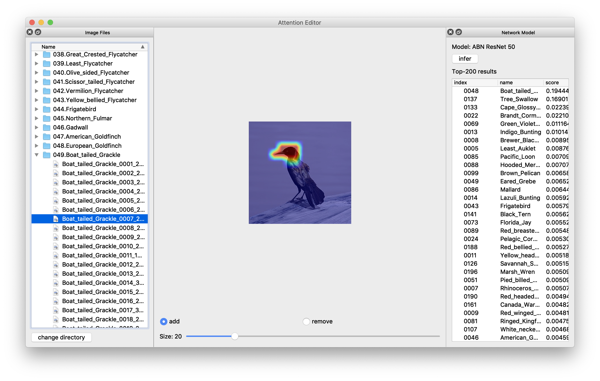

# Attention Editor

Author: Masahiro Mitsuhara

Maintainer: [Tsubasa Hirakawa](https://thirakawa.github.io)


## 動作環境

### Python
Anaconda (3-5.3.1) を用いてPython環境を構築しています．
* torch (0.4.1)
* torchvision (0.2.1)
* opencv (3.4.2)
* PyQt5 (5.9.2)


## 使用方法

### CUB-200-2010 datasetのダウンロード
CUB-200-2010 datasetを下記のwebページからダウンロードし，保存します．
[CBU-200-2010 dataset](http://www.vision.caltech.edu/visipedia/CUB-200.html)


### 学習済みモデルのダウンロード
学習済みモデルを下記のURLからダウンロードします．
* [ResNet18](https://drive.google.com/open?id=1SGlBahck_F8CkBmfxkCCjBjA_2UT_t1v)
* [ResNet34](https://drive.google.com/open?id=1u0HI9FXjoO_WH4JLQvqE_ZEvp_0WD-PH)
* [ResNet50](https://drive.google.com/open?id=15it2_wGo41FRFlrTMJR66Ve42P1lJNDr)


### configファイルの編集
./atteditor/config.py内のパスを各自の環境に合わせて書き換えます．
```python
# 本プロジェクトのディレクトリまでのパス
PROJECT_ROOT = "/path/to/AttentionEditorABN"

# データセット（画像）を保存しているディレクトリまでのパス
IMAGE_DIR = "/path/to/CUB-200-2010_dataset"

# アプリケーションに表示するネットワーク名
MODEL_NAME = "ABN ResNet 50"

# 学習済みモデルのパス
CHECKPOINT_FILE = "/path/to/pretrained_model_file"
```

### 起動
下記のコマンドを実行することでアプリケーションが起動します．
```bash
python3 main.py
```

### 操作

左側のウィンドウは使用する画像データを指定するためのウィンドウです．
右側のウィンドウは指定したネットワークモデルを使用して推論・推論結果を表示するためのウィンドウです．
中央の部分で画像・アテンションマップの表示，修正を行います．



## Reference
If you find useful for this application, please cite the following reference.
1. M. Mitsuhara, H. Fukui, Y. Sakashita, T. Ogata, T. Hirakawa, T. Yamashita, H. Fujiyoshi, "Embedding Human Knowledge into Deep Neural Network via Attention Map," arXiv preprint, arXiv:1905.03540, 2019.
